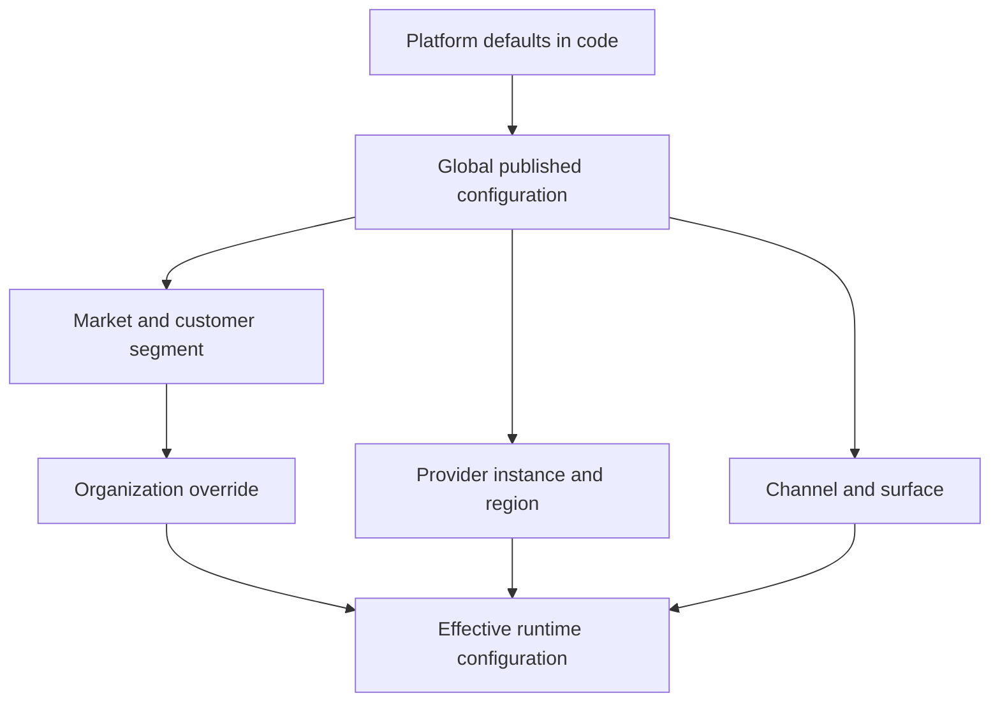
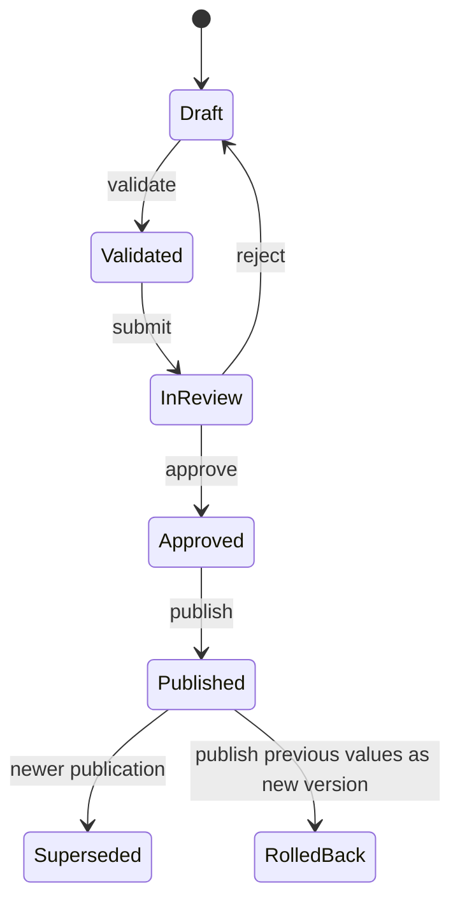

# Admin configuration architecture

Status: proposed
Owner: Platform architecture
Updated: 2026-09-15

## Goal

The ONHOST staff console must configure the platform through one governed model while each domain keeps ownership of its rules. Configuration is metadata and domain commands, not arbitrary key/value editing. Secrets remain references in OpenBao or the environment and never appear in API responses, audit details, exports, or AI context.

## Configuration hierarchy



Precedence is explicit: organization override → segment override → global published value → code default. Provider, region, and channel selectors are orthogonal scopes and may only be used by definitions that declare them. Runtime consumers request an effective typed configuration; they never parse the admin form or read draft values.

## Segmentation model

| Axis | Examples | Used for | Owner |
| --- | --- | --- | --- |
| Market | CZ, SK, EU; locale; currency; tax zone | copy, tax, payment methods, legal documents | Product/Finance |
| Customer | individual, business, agency, partner, enterprise | catalogue visibility, onboarding, SLA, support | Product/Sales |
| Lifecycle | lead, trial, active, overdue, suspended, churn-risk | messaging and safe offers | Sales/Support |
| Product | web, managed, VPS, game, mail, domain, DNS | plans, features, provisioning workflows | Product/Infra |
| Infrastructure | provider, instance, region, node role, capacity pool | placement, failover, maintenance | Infra |
| Risk | normal, review, restricted; verified/unverified | approval and transaction limits | Security/Finance |
| Channel | public web, customer panel, admin, mobile, partner, API | navigation, content and feature exposure | Product/Content |
| Staff | support L1/L2, lead, sales, finance, infra, security, exec, editor | viewing, editing, approval | IAM |

Segments are stable identifiers with human labels, predicates, priority, active dates, owner, and test fixtures. Business-critical membership is calculated server-side from canonical data. Staff may preview why an organization matched a segment but cannot manually rewrite derived facts. Explicit membership is reserved for approved commercial programmes and records its reason and expiry.

## Configurable areas

| Admin area | Elements | Existing source to reuse | Publication risk |
| --- | --- | --- | --- |
| Catalogue | categories, plans, SKUs, periods, add-ons, availability, regional pricing | `Catalog`, `PricingRules`, panel navigation | price/plan: step-up + second person; withdrawal: step-up; navigation: normal |
| Providers | provider instances, capabilities, regions, nodes, placement rules, health | integrations API and provider registry | critical for credentials/infra |
| Orders and billing | payment routes, invoice rules, dunning, tax, refund and credit limits | Billing, Payments, Tax, Risk | critical |
| Provisioning | workflow selection, retries, capacity thresholds, maintenance windows | Provisioning and operations board | critical |
| Customer experience | panel navigation, feature visibility, onboarding, status pages | `panel.nav`, ContentService, surface seams | medium/high |
| Support | queues, topics, SLA policies, escalation, templates | Support, Notifications, Incidents | high |
| Security and IAM | staff role grants, MFA policy, IP restrictions, step-up rules | PermissionCatalog and RoleCatalog | critical |
| Content and brand | localized copy, legal version, approved asset reference, theme release | ContentService and design system | high when publishing |
| Brain and automation | context freshness policy, allowed tools, quality gates, reviewer routing | repository Brain configuration | high; repository-backed only |

## Configuration Registry

Each configurable element registers a definition in code:

```text
key              catalog.plan.visibility
domain           Catalog
schema           typed JSON schema
allowed_scopes   global, market, customer_segment
default          code-owned safe value
permission       catalog.configuration.manage
risk             HIGH
validator        CatalogConfigurationValidator
previewer        CatalogImpactPreview
publisher        PublishCatalogConfigurationHandler
redaction        no secrets allowed
dependencies     panel.nav, content.offer
```

The registry supplies form metadata, validation rules, permission checks, dependency edges and safe rendering hints. It does not contain business data or credentials. Custom PHP validators enforce domain invariants that JSON Schema cannot express.

## Storage model

Retain `system_settings` as a compatibility read model. Add versioned configuration records instead of expanding it into an untyped control plane:

```text
configuration_sets
  id, name, environment, state, base_version_id
  created_by, submitted_by, approved_by, published_by
  created_at, published_at, change_reason

configuration_values
  configuration_set_id, definition_key
  scope_type, scope_id, selector_json
  value_json, value_hash

configuration_publications
  id, configuration_set_id, previous_publication_id
  checksum, published_by, published_at, rollback_of_id

segment_definitions
  id, key, axis, label_json, predicate_json
  priority, starts_at, ends_at, enabled, owner

segment_memberships
  segment_id, subject_type, subject_id
  source, reason, starts_at, ends_at
```

Published values are immutable. A correction creates a new configuration set. `value_hash` and the publication checksum make export, comparison, cache invalidation and rollback deterministic.

## State and approval workflow



Who a change takes (owner decision 13, 2026-09-25; code: `IdentityCommandAuthorizer`, `ApprovalService`, `CatalogCommand`;
runbook: `docs/runbooks/approvals.md`):

- **NORMAL**: the permission alone, no step-up. Low-risk changes may combine approval and publication when the actor has the permission.
- **HIGH**: a fresh step-up of the author, **no second person**.
- **CRITICAL**: a fresh step-up **and a second person**. The second person is not the requester, holds `iam.approval.decide`
  **and** the permission of the action itself, confirms with a step-up of their own, and the approval is good for one command
  with one payload, once, for 24 h (`ONHOST_APPROVAL_TTL_HOURS`).
- **Every change of a price or a plan in the admin configuration** takes a step-up and a second person, regardless of the
  permission's own level (`catalog.manage` is HIGH; `CatalogCommand::requiresApproval()` adds the second person): commitment
  discounts, regional pricing, domain discounts, active promo codes, option and add-on unit prices and their removal,
  publishing or rolling back a plan version, putting a product on sale, the deletion lifecycle (archive download fee). An
  operation the command does not classify is treated as a price change (fail closed).
- **Withdrawals** are HIGH (one person with a step-up): deleting a domain discount or a promo code, pausing or retiring a
  promo code, taking a product off sale (also `onhost:catalog:state draft` from the server), and composing a product's
  add-on list from products already on sale. The panel navigation is NORMAL.
- A price/plan change is checked before the request for approval is opened (a change that would be refused never reaches
  an approver) and is bound to what it was asked against (the plan version on sale, a digest of a replaced setting): an
  approval given against one state is not spent on another (`409 catalog_changed_since_request`).
- **Single operator**: `ONHOST_FOUR_EYES=false`, set on the server only, waives the second person; the step-up stays and the
  audit records `approval_ids: ["waived:single-operator"]`.
- An author can never approve their own CRITICAL or price/plan change.
- A change window and a tested rollback for CRITICAL changes are the design target of configuration sets below; **nothing
  enforces them today**.
- Publishing goes through a `GlobalCommand` or `OrganizationCommand` plus `RiskAwareCommand`, `CommandBus`, `AuditRecorder` and outbox event.

## Admin information architecture

Add **Nastavení systému** as one entry in the existing console with these pages:

1. **Přehled** - environment, active publication, pending approvals, failing validations, drift and recent changes.
2. **Segmenty** - axes, predicates, membership preview and collision detection.
3. **Katalog a ceny** - plans, add-ons, availability, regions and impact on current customers.
4. **Integrace a infrastruktura** - reuse the existing onboarding, probes, discovery, capabilities and nodes.
5. **Objednávky a finance** - payment routes, tax, dunning, limits and reconciliation; strict dual control.
6. **Provisioning a provoz** - placement, queues, retries, capacity and maintenance.
7. **Panel, obsah a značka** - navigation, localized content, legal versions and approved brand release.
8. **Podpora a komunikace** - SLA, queues, escalation and templates.
9. **Bezpečnost a přístupy** - role catalogue, policies and break-glass overview.
10. **Brain a automatizace** - read-only runtime health plus repository change proposals.
11. **Změny a schválení** - draft comparison, impact, approval, publish and rollback.
12. **Audit** - who changed what, reason, scope, before/after hashes and correlation ID.

The main page uses progressive disclosure: health and impact first, advanced selectors later. Every editor has loading, empty, error, validation, preview, published and rollback states. Destructive or customer-impacting actions show affected counts and require a typed reason.

## API contract

```text
GET    /v1/staff/configuration/registry
GET    /v1/staff/configuration/effective?scope=...
GET    /v1/staff/configuration/sets
POST   /v1/staff/configuration/sets
PUT    /v1/staff/configuration/sets/{id}/values/{key}
POST   /v1/staff/configuration/sets/{id}/validate
POST   /v1/staff/configuration/sets/{id}/preview
POST   /v1/staff/configuration/sets/{id}/submit
POST   /v1/staff/configuration/sets/{id}/approve
POST   /v1/staff/configuration/sets/{id}/publish
POST   /v1/staff/configuration/publications/{id}/rollback
GET    /v1/staff/segments
POST   /v1/staff/segments/{id}/preview
```

All writes use idempotency keys and optimistic concurrency (`If-Match` with the set checksum). API responses return typed validation errors, dependency conflicts, affected counts and required approval level. Credential forms send values directly to the secret store workflow and persist only a `SecretRef`.

## Runtime resolution

`EffectiveConfigurationResolver` accepts a definition key and a typed context containing organization, market, product, provider, region and channel. It returns the validated value, winning scope, publication ID and checksum. Cache keys include publication checksum; publishing emits `configuration.published`, and consumers invalidate by checksum. Resolution must stay deterministic and side-effect free.

Configuration cannot directly execute provisioning, charge money or migrate data. Publication changes policy; subsequent domain commands apply it. A preview may calculate impact but must not mutate state.

## Brain integration

The admin displays Brain health and may create a repository-backed proposal, but database settings cannot override `AGENTS.md`, hooks, tests or security gates.

- Read-only: branch, context freshness, last tests, security status, tool availability and reviewer status.
- Proposal: create a reviewed Git patch for allowed Brain configuration keys.
- Apply: merge through Git/PR, then refresh Brain context.
- Forbidden: storing prompts with secrets, editing arbitrary repository files, bypassing hooks or launching production commands.

This preserves Git as the authority for development policy and the admin database as the authority for runtime business configuration.

## Permissions

Use narrow permissions rather than `is_staff` alone:

```text
configuration.read
configuration.draft.manage
configuration.validate
configuration.approve.critical
configuration.publish
configuration.rollback
segment.manage
catalog.configuration.manage
integration.configuration.manage
billing.configuration.manage
provisioning.configuration.manage
experience.configuration.manage
brain.status.read
brain.proposal.create
```

Routes and commands both enforce permission and risk. Security auditors receive read-only access including audit and effective-value provenance.

## Validation and impact preview

Validation runs in layers:

1. JSON shape and primitive constraints.
2. Domain rules: money, currencies, state compatibility, provider capabilities and role boundaries.
3. Cross-definition dependencies and cycles.
4. Referential checks for plans, regions, provider instances and templates.
5. Impact counts: organizations, services, renewals, queued operations and surfaces.
6. Dry-run projections using fixtures or sanitized identifiers.
7. Required tests and release gates selected from changed definition domains.

The preview never lists private customer data. It reports counts, anonymized examples, warnings, blocking errors and rollback readiness.

## Delivery slices

### Slice 1 - foundation

Registry, versioned sets, effective resolver, permission model, audit, API and a basic overview/diff UI. Migrate only `panel.nav` as the proving configuration.

### Slice 2 - catalogue and experience

Catalogue visibility, regions, panel navigation and content publication with segment preview. Add Playwright coverage for staff draft → preview → publish and customer effective view.

### Slice 3 - providers and operations

Wrap existing integration settings, placement and thresholds in registry definitions without moving secret values. Add health and drift gates.

### Slice 4 - finance and security

Move only reviewed rules after dual-control, step-up, immutable publication and rollback paths are proven. Keep money and authorization rules inside their domains.

### Slice 5 - Brain status

Expose read-only generated status first. Add Git-backed proposals only after threat modelling and repository isolation.

## Definition of done

- One value has one owner and one authoritative storage location.
- Draft values never affect runtime.
- Effective values include provenance and publication checksum.
- HIGH publication enforces a step-up; CRITICAL and price/plan publication enforce a step-up and separation of duties (a second person).
- Secrets are references and never round-trip through the browser.
- Publish and rollback are idempotent, audited and emit outbox events.
- UI preserves the existing admin surface and design tokens.
- Tests cover permissions, concurrency, inheritance, invalid combinations, publication, rollback and customer-visible projection.
- Existing application behavior remains unchanged until a definition is explicitly migrated.
